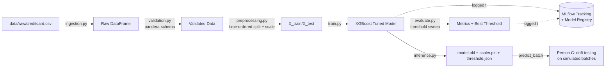

# Credit Card Fraud Detection — MLOps Pipeline

## Architecture



All five stages are chained by `src/fraud_pipeline/pipeline.py` — a plain Python
function, no external scheduler required. `Makefile`'s `pipeline` target just calls it
(`make pipeline` == `python -m src.fraud_pipeline.pipeline`).

## Before / After

| | Before (Part A notebook) | After (this repo) |
|---|---|---|
| **Execution** | Manual, cell-by-cell, order-dependent | `make pipeline` or `python -m src.fraud_pipeline.pipeline` |
| **Params & metrics** | Printed to cell output, lost on restart | Logged to MLflow per run, queryable/comparable |
| **Model artifact** | `joblib.dump()` to a loose `.pkl` file | Versioned in the MLflow Model Registry |
| **Data checks** | pandera schema run once, inline | `validation.py`, unit-tested, runs every pipeline execution |
| **Split/scaling logic** | Notebook globals (`X_train`, `scaler`, ...) | Pure functions in `preprocessing.py`, testable and reusable |
| **Reruns** | Depends on notebook author's local env | Docker image or pinned `requirements.txt` |
| **Correctness checks** | None | `pytest` suite (validation, preprocessing, evaluation math, inference contract) |
| **Batch scoring for drift testing** | Not exposed | `inference.predict_batch()` — one documented function |

## Repo structure

```
fraud-pipeline/
├── configs/config.yaml          # all hyperparameters, paths, split ratio, MLflow settings
├── data/{raw,processed}/        # gitignored; populated by ingestion stage
├── models/                      # gitignored; model.pkl, scaler.pkl, threshold.json land here
├── src/fraud_pipeline/
│   ├── config.py                # loads config.yaml
│   ├── ingestion.py              # Stage 1 — local CSV load
│   ├── validation.py             # Stage 2 — pandera schema
│   ├── preprocessing.py          # Stage 3 — time-ordered split + Amount scaling
│   ├── train.py                  # Stage 4 — model training + MLflow logging/registry
│   ├── evaluate.py               # Stage 5 — metrics + threshold sweep + MLflow logging
│   ├── inference.py              # Batch scoring interface — Person C's contract
│   └── pipeline.py               # ties all stages together, plain Python
├── tests/                        # pytest — code correctness, not model quality
├── notebooks/                    # original notebook, kept for reference/audit trail
├── Dockerfile / requirements.txt # reproducible environment
├── Makefile                      # thin wrapper around pipeline.py / pytest / docker
└── .github/workflows/ci.yml      # lint + test on every push/PR
```

## Setup

**Get the data first (both options need this):**

Place `creditcard.csv` — the same file Person A's notebook used — at `data/raw/creditcard.csv`
in this repo. `ingestion.py` reads it from there; no Kaggle account or API key needed.

**Option A — Docker (recommended for "someone else can rerun this")**

```bash
docker build -t fraud-detection-pipeline .
docker run --rm \
  -v $(pwd)/data:/app/data \
  -v $(pwd)/models:/app/models \
  -v $(pwd)/mlruns:/app/mlruns \
  fraud-detection-pipeline
```

**Option B — local virtual environment**

```bash
python -m venv .venv
source .venv/bin/activate          # Windows: .venv\Scripts\activate
pip install -r requirements.txt

make pipeline                      # or: python -m src.fraud_pipeline.pipeline
```

Either way, on completion you'll have:
- `models/model.pkl`, `models/scaler.pkl`, `models/threshold.json` — everything Person C needs
- `mlflow.db` — the MLflow tracking store (SQLite); `mlruns/` still holds the actual model/artifact files

## Experiment tracking

`mlflow ui --backend-store-uri sqlite:///mlflow.db` (from the repo root) opens the tracking UI
at `http://localhost:5000`. Plain `mlflow ui` with no arguments won't find anything — it looks at
a local `./mlruns` folder by default, but this project points MLflow at a SQLite database instead
(MLflow's plain-folder file store is in maintenance mode as of recent versions and refuses to be
used without an opt-out flag, so this repo uses the database backend it recommends instead).
Every pipeline run logs:
- **Params:** model hyperparameters, `scale_pos_weight`
- **Metrics:** precision, recall, F1, ROC-AUC, PR-AUC, best threshold, best F1
- **Artifacts:** the model, `threshold_sweep.csv`, `threshold_sweep.png`
- **Registry:** the tuned XGBoost model is registered as `fraud-detector` on every run,
  so you can compare/promote versions from the MLflow UI instead of tracking `.pkl`
  files by filename.

## Testing

```bash
pytest tests/ -v
```

Tests cover **pipeline correctness**, not model quality:
- schema validation rejects malformed rows (negative amounts, bad labels)
- the split is time-ordered and holds the configured ratio
- the scaler is fit on train only and actually normalizes `Amount`
- threshold-sweep math and best-threshold selection are correct on known inputs
- `predict_batch()` returns the right shape/columns and rejects malformed batches

CI (`.github/workflows/ci.yml`) runs lint + the full suite on every push/PR to `main`.

## Reproducibility & deployment readiness

- **Environment** is pinned (`requirements.txt`) and containerized (`Dockerfile`) —
  no dependency on a specific notebook runtime or local package versions.
- **Config, not hardcoding** — every threshold, split ratio, and hyperparameter lives
  in `configs/config.yaml`, not scattered across code.
- **No inline secrets** — the original notebook's inline Kaggle access token should be treated
  as compromised and rotated. This pipeline needs no credentials at all: it reads the dataset
  from a local file instead of calling an external API.
- **Deterministic** given the same input `creditcard.csv`: `random_state=42` is
  set everywhere, and the split is time-based (not randomly sampled), so reruns are
  stable.
- **One entry point**: `make pipeline` (or the Docker `CMD`) is the only thing anyone
  needs to run — no manual cell execution, no hidden ordering requirements.


```python
from src.fraud_pipeline.inference import load_inference_artifacts, predict_batch

model, scaler, threshold = load_inference_artifacts()
scored_df = predict_batch(simulated_batch_df, model, scaler, threshold)
# scored_df has all of simulated_batch_df's columns plus:
#   fraud_probability — model's raw score
#   fraud_prediction  — thresholded 0/1 call
```
