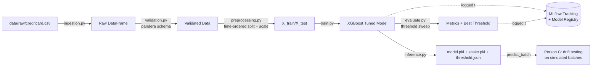

# Credit Card Fraud Detection — MLOps Pipeline

## Architecture



## Repo structure

```
fraud-pipeline/
├── configs/config.yaml          # all hyperparameters, paths, split ratio, MLflow settings
├── data/{raw,processed}/        # gitignored; populated by ingestion stage
├── models/                      # gitignored; model.pkl, scaler.pkl, threshold.json land here
├── src/fraud_pipeline/
│   ├── config.py                # loads config.yaml
│   ├── ingestion.py              # Stage 1 — local CSV load
│   ├── validation.py             # Stage 2 — pandera schema
│   ├── preprocessing.py          # Stage 3 — time-ordered split + Amount scaling
│   ├── train.py                  # Stage 4 — model training + MLflow logging/registry
│   ├── evaluate.py               # Stage 5 — metrics + threshold sweep + MLflow logging
│   ├── inference.py              # Batch scoring interface — Person C's contract
│   └── pipeline.py               # ties all stages together, plain Python
├── tests/                        # pytest — code correctness, not model quality
├── notebooks/                    # original notebook, kept for reference/audit trail
├── Dockerfile / requirements.txt # reproducible environment
├── Makefile                      # thin wrapper around pipeline.py / pytest / docker
└── .github/workflows/ci.yml      # lint + test on every push/PR
```

## Setup

Place `creditcard.csv` in the data/raw folder


```bash
python -m venv .venv
source .venv/bin/activate          # Windows: .venv\Scripts\activate
pip install -r requirements.txt

make pipeline                      # or: python -m src.fraud_pipeline.pipeline
```

on completion you'll have:
- `models/model.pkl`, `models/scaler.pkl`, `models/threshold.json` 
- `mlflow.db` ; `mlruns/` 

## Experiment tracking

Every pipeline run logs:
- **Params:** model hyperparameters, `scale_pos_weight`
- **Metrics:** precision, recall, F1, ROC-AUC, PR-AUC, best threshold, best F1
- **Artifacts:** the model, `threshold_sweep.csv`, `threshold_sweep.png`
- **Registry:** the tuned XGBoost model is registered as `fraud-detector` on every run,
  so you can compare/promote versions from the MLflow UI.

## Reproducibility & deployment readiness

- **Environment** is pinned (`requirements.txt`) and containerized (`Dockerfile`) —
  no dependency on a specific notebook runtime or local package versions.
- Every threshold, split ratio, and hyperparameter lives
  in `configs/config.yaml`.
- **Deterministic** given the same input `creditcard.csv`: `random_state=42` is
  set everywhere, and the split is time-based (not randomly sampled), so reruns are
  stable.
- **One entry point**: `make pipeline` (or the Docker `CMD`) is the only thing anyone
  needs to run.
